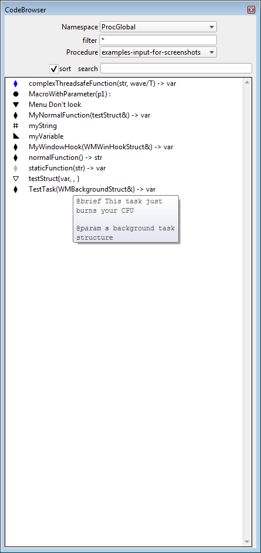

## The CodeBrowser makes browsing through projects with multiple files and lots of functions easy, convenient and pleasant.

#### Requirements

- Igor Pro version 6.3.0 or later

#### Installation

1. Install Igor
2. Start Igor, this will create a folder called WaveMetrics in Documents and then close it
3. Extract the zip file into folder somewhere on your disc
4. Create a link from `CodeBrowser-v*/procedures` to `Documents\WaveMetrics\Igor Pro * User Files\Igor Procedures`
5. Start Igor and in the main menu you can now find `CodeBrowser/Open`

#### Features

- Shows all functions/macros from a procedure file including parameter
  types, return types and special properties (like static,
  threadsafe, etc.)
- Shows Menu/Constant/StrConstant/Structure entries
- Shows the structure name for window hook and background tasks for easier searching
- Allows jumping to their definitions by mouse and keyboard
- Optionally alphabetically sorted lists
- Shows function comments as tooltip (IP8 only)
- Works with Independent Modules

For reasons of ease-of-use the function declarations are displayed as
`myFunction(var, str) -> var` for a function taking a variable and
string parameter and returning a variable. Programmers might recognize
this as being inspired by the trailing return types from C++11.

#### Navigation by keyboard

- Open the panel or brings it to the front with CTRL+0 (zero)
- Jump to the definition of the listbox selection with "." (dot)
- Pressing any character while the ListBox has the focus will jump to
  the first listbox entry which starts with that character.

#### Limitations

- No parameter types shown for macros

#### Screenshot

